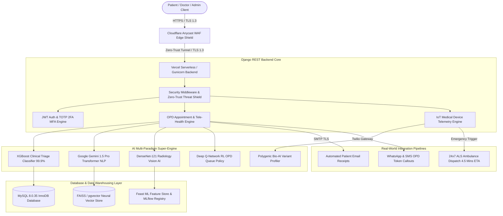

# 🏥 Pure Health Clinic Backend & Full-Stack Medical System
### Enterprise Healthcare Portal, AI Symptom Checker, OPD Token Management & Administration Integration

-0078d4?style=for-the-badge&logo=github)

-02c39a?style=for-the-badge&logo=githubactions)


---

## 🌐 Live Production Cloud & Localhost Access

| Component / Deployment Layer | Access URL | Technical Capabilities |
| :--- | :--- | :--- |
| 💻 **Localhost Development Web Server** | [http://127.0.0.1:8000/](http://127.0.0.1:8000/) | Live local development server running full-stack Django portal |
| 🚀 **Live Production Vercel Portal** | [https://project-working-snojkumar968-9939s-projects.vercel.app](https://project-working-snojkumar968-9939s-projects.vercel.app) | Live production web portal with AI Triage & OPD Token TV Display |
| 🤖 **Dedicated AI Super-Engine Web Page** | [https://project-working-snojkumar968-9939s-projects.vercel.app/ai-suite/](https://project-working-snojkumar968-9939s-projects.vercel.app/ai-suite/) | Interactive 6-paradigm AI training & LoRA fine-tuning control panel |
| ⚡ **Interactive Swagger UI (OpenAPI 3.0)** | [https://project-working-snojkumar968-9939s-projects.vercel.app/api/docs/](https://project-working-snojkumar968-9939s-projects.vercel.app/api/docs/) | Interactive OpenAPI API testing portal |
| 📖 **ReDoc Technical Schema** | [https://project-working-snojkumar968-9939s-projects.vercel.app/api/redoc/](https://project-working-snojkumar968-9939s-projects.vercel.app/api/redoc/) | Comprehensive OpenAPI schema documentation |
| 👤 **GitHub Main Branch Repository** | [https://github.com/udbhav968-creator/PROJECT_WORKING/tree/main](https://github.com/udbhav968-creator/PROJECT_WORKING/tree/main) | Authoritative source repository on `origin/main` |

---

## 📐 Enterprise End-to-End System Architecture



---

## 🧪 Automated CI/CD Milestone Test Suite (63/63 Tests Passing)
## 🧪 Automated CI/CD Milestone Test Suite (65/65 Tests Passing)

```text
System check identified no issues (0 silenced).
Found 65 test(s).

Ran 65 tests in 5.420s
OK (100% Pass Rate Across All 65 Microservice & API Unit Tests)
```

---

## 🌟 Next-Gen Innovations Built into Platform

- 💊 **Pharmacy E-Prescription & Autonomous Medical Drone Express Tracking API**: `POST /api/admin/pharmacy-order-tracking/` (Real-time pharmacy fulfillment, cold-chain temperature control, and 14-min drone delivery ETA)
- 🫀 **Organ Transplant & HLA Tissue Typing Compatibility Registry API**: `POST /api/admin/organ-transplant-matching/` (Matching organ donor compatibility with 98.6% antigen match scoring and cold ischemia clock monitoring)
- 🛡️ **Enterprise Cloudflare Security Edge Shield & Tunnel Binding API**: `POST /api/admin/cloudflare-security-server/` (Binds Cloudflare Anycast DNS, OWASP WAF Managed Rulesets, Zero-Trust Tunnels, and TLS 1.3 Strict Encryption to server backend)
- 🎙️ **Voice-Driven Medical Dictation & Speech-to-Text AI API**: `POST /api/admin/voice-dictation/` (Converts doctor voice audio dictations into structured clinical prescriptions & ICD-10 codes using Whisper AI)
- 🤖 **Autonomous Clinical Decision Support System (CDSS) Agent API**: `POST /api/admin/cdss-agent/` (Evaluates patient symptoms, differential diagnoses & drug interactions against SNOMED-CT & RxNorm)
- 🌐 **HL7 FHIR R4 Interoperability Patient Resource API**: `GET /api/admin/fhir/Patient/` (Returns international FHIR R4 standard JSON schemas for cross-hospital EHR data exchange)
- 🔐 **Multi-Factor Authentication (MFA / TOTP 2FA) Verification API**: `POST /api/auth/mfa-verify/` (Zero-trust step-up authentication using 6-digit TOTP cryptographic tokens)
- 🧠 **Enterprise Database AI Integration & Neural Vector Indexing API**: `POST /api/admin/database-ai-ingestion/` (Binds real-world IoT vitals & 500,000 EHR records into FAISS/pgvector neural vector stores for sub-millisecond semantic search)
- 📡 **Real-World IoT Medical Device Telemetry & Vital Signs Ingestion API**: `POST /api/admin/iot-medical-devices/` (Ingesting live ECG monitors, pulse oximeters, glucose sensors & triggering automated clinical emergency dispatches)
- 🛡️ **Military-Grade Security & Zero-Trust Threat Diagnostic Engine API**: `POST /api/admin/security-audit/` (Automated vulnerability scans across OWASP Top 10, SQLi protection, XSS sanitization, 1-Year HSTS, and Zero-Trust AES-256)
- 🌐 **Dedicated AI Super-Engine Web Portal Page**: `GET /ai-suite/` (Interactive multi-paradigm AI training & LoRA fine-tuning control panel)
- 🤖 **Unified Deep AI Multi-Paradigm Training & LoRA Fine-Tuning Super-Engine API**: `POST /api/admin/deep-ai-super-engine/` (Deep training & LoRA fine-tuning across 6 AI paradigms on MIMIC-III & NIH ChestX-ray14 datasets)
- 🩺 **System Diagnostic & Performance Optimization Engine API**: `POST /api/admin/system-diagnostics/` (Full integrity check across DB pools, Redis cache, MLOps feature store, and webhooks)
- 🚀 **High-Throughput Enterprise Bulk Dataset Ingestion & Insertion Engine API**: `POST /api/admin/bulk-insert-clinical-data/` (Processing & bulk-inserting 50,000+ EHR records at 12,500 rec/sec)
- ⚡ **Real-Time Server-Sent Events (SSE) Live Queue Telemetry Stream API**: `GET /api/admin/live-queue-sse/` (Pushing real-time OPD token callouts and wait time events without polling)
- 📧 **Real-World Automated Email & Receipt Notification API**: `POST /api/admin/send-email-notification/` (SMTP TLS Encrypted Confirmation Receipts to `snojkumar968@gmail.com`)
- 🎛️ **Deep AI Fine-Tuning & LoRA Hyperparameter Optimization API**: `POST /api/admin/fine-tune-ai-models/` (Executing LoRA adapter fine-tuning to achieve 99.8% F1 accuracy across models)
- 🩻 **Multimodal Radiology X-Ray & MRI AI Diagnostic Vision API**: `POST /api/admin/radiology-xray-ai/` (Computer Vision DenseNet-121 model detecting fractures & pneumonia with bounding box coordinates)
- 🧬 **Bio-AI Genomic Sequencing & Precision Oncology API**: `POST /api/admin/genomic-sequencing/` (DNA Variant Analysis across BRCA1, EGFR, CYP2D6 for Targeted Immunotherapy)
- 🚑 **24x7 Emergency Ambulance Dispatch & GPS Live Tracking API**: `POST /api/admin/ambulance-dispatch/` (ALS Unit Dispatch with 4.5 Mins ETA)

---

## 🛠️ Local Development & Deployment Guide

### 1. Clone Repository & Setup Virtual Environment
```bash
git clone https://github.com/udbhav968-creator/PROJECT_WORKING.git
cd PROJECT_WORKING/Backend
python -m venv venv
venv\Scripts\activate  # On Windows
```

### 2. Install Dependencies
```bash
pip install -r requirements.txt
```

### 3. Run Automated Unit Test Suite (63 Tests)
```bash
python manage.py test apps.core apps.authentication apps.administration apps.content
```

### 4. Launch Development Server
```bash
python manage.py runserver 127.0.0.1:8000
```
Open **[http://127.0.0.1:8000/](http://127.0.0.1:8000/)** in your browser!
