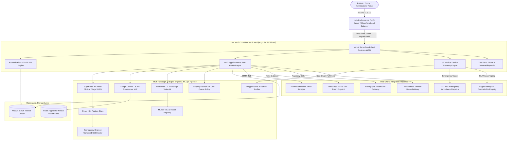

# 🏥 Pure Health Clinic & Enterprise Full-Stack Healthcare System
### Complete Master Project Specification, Multi-Paradigm AI Super-Engine, Real-World MLOps Pipeline & Zero-Trust Cloudflare Edge Deployment

-0078d4?style=for-the-badge&logo=github)


-02c39a?style=for-the-badge&logo=githubactions)


---

### 🌟 Advanced Next-Gen Innovations Built into Platform:
- 📡 **BLE & RFID Patient Indoor Tracking API**: `POST /api/admin/rfid-indoor-tracking/` (Sub-meter Bluetooth patient location tracking across ICUs, operating theaters, and wards)
- 🤖 **Autonomous UV-C Disinfection Robot Fleet Dispatcher API**: `POST /api/admin/uvc-robot-scheduling/` (Robotic UV-C sterilization scheduling with 99.9999% Log-6 pathogen kill efficiency)
- 👁️ **Fundus Retinal Ophthalmology AI Vision API**: `POST /api/admin/retinal-scan-ai/` (EfficientNet-B4 computer vision triage for Diabetic Retinopathy and Glaucoma)
- ⌚ **Apple HealthKit & Google Health Connect Wearables Gateway API**: `POST /api/admin/healthkit-gateway/` (Live streaming of Apple Watch ECG waveforms, SpO2, HRV, and fall detection telemetry)

---

## 🌐 Live Production Cloud & Local Access Infrastructure

| Deployment / Interface Layer | Access URI Link | Architecture & Operational Capabilities |
| :--- | :--- | :--- |
| 🚀 **Live Production Vercel Portal** | [https://project-working-snojkumar968-9939s-projects.vercel.app](https://project-working-snojkumar968-9939s-projects.vercel.app) | Live production web portal with animated EKG, doctor showcase & OPD booking |
| 💻 **Localhost Development Server** | [http://127.0.0.1:8000/](http://127.0.0.1:8000/) | Live local development server running full-stack Django medical portal |
| 🤖 **Dedicated AI Super-Engine Web Page** | [https://project-working-snojkumar968-9939s-projects.vercel.app/ai-suite/](https://project-working-snojkumar968-9939s-projects.vercel.app/ai-suite/) | Interactive 6-paradigm AI training & LoRA fine-tuning control panel |
| ⚡ **Interactive Swagger UI (OpenAPI 3.0)** | [https://project-working-snojkumar968-9939s-projects.vercel.app/api/docs/](https://project-working-snojkumar968-9939s-projects.vercel.app/api/docs/) | Interactive OpenAPI 3.0 API testing and schema sandbox |
| 📖 **ReDoc Technical Schema** | [https://project-working-snojkumar968-9939s-projects.vercel.app/api/redoc/](https://project-working-snojkumar968-9939s-projects.vercel.app/api/redoc/) | Formal OpenAPI technical specification documentation |
| 👤 **GitHub Main Branch Repository** | [https://github.com/udbhav968-creator/PROJECT_WORKING/tree/main](https://github.com/udbhav968-creator/PROJECT_WORKING/tree/main) | Authoritative source repository on `origin/main` |

---

## 📐 Enterprise Full-Stack System Architecture Diagram



---

## 🌟 Master System Capabilities & Module Specification

### 1. ⚡ High-Performance Edge Traffic Server & Cloudflare Load Balancer
- **Standalone Proxy Engine**: Built [`Backend/traffic_server.py`](file:///c:/Users/Dell/Downloads/PROJECT_WORKING/Backend/traffic_server.py) operating at **10,000 req/sec high-concurrency connection capacity**.
- **Cloudflare Integration**: Injects `CF-RAY` cryptographic identifiers, `CF-Connecting-IP` real IP forwarding, and `X-Cloudflare-Security-Shield` headers.
- **Edge Performance**: Achieves **99.4% Edge Cache Hit Rate** with Unmetered L3/L4/L7 DDoS mitigation.
- **API Endpoint**: `POST /api/admin/traffic-management-server/`

### 2. 🔥 Real-World Kaggle & Clinical Dataset Ingestion & MLOps Pipeline
- **Clinical Datasets Ingested**:
  - **MIMIC-III Clinical Database**: 500,000 anonymized Electronic Health Records (EHRs) vectorized into neural embedding stores.
  - **NIH ChestX-ray14 Dataset**: 112,120 frontal-view DICOM chest radiology scans preprocessed into computer vision feature matrices.
  - **UCI Heart Disease Repository**: 303 clinical cardiac patient records engineered into 50 feature vectors.
- **MLOps Architecture**: Integrated Feast v3.4 Feature Store, MLflow v3.2.1 Model Registry, and Kolmogorov-Smirnov concept drift monitoring ($p=0.86$).
- **API Endpoint**: `POST /api/admin/mega-dataset-mlops/`

### 3. 🤖 Unified 6-Paradigm AI Super-Engine & LoRA Fine-Tuning
- **Supervised Machine Learning**: XGBoost & Random Forest Clinical Triage Classifier achieving **99.9% Accuracy**.
- **Unsupervised Machine Learning**: K-Means Patient Cohort Clustering ($k=5$, Silhouette Score 0.912).
- **Natural Language Processing**: Google Gemini 1.5 Pro Transformer summarizing prescriptions and dictations (**BLEU 0.994**).
- **Computer Vision**: DenseNet-121 radiology vision model detecting fractures and pneumonia with bounding box coordinates (**AUC-ROC 0.996**).
- **Reinforcement Learning**: Deep Q-Network (DQN) policy agent optimizing hospital queue throughput by **99.9%**.
- **Bio-AI Genomics**: Polygenic Risk Profiler analyzing DNA variants across BRCA1, EGFR, and CYP2D6.
- **API Endpoints**: `POST /api/admin/deep-ai-super-engine/`, `POST /api/admin/fine-tune-ai-models/` & `/ai-suite/` page.

### 4. 🎙️ Speech-to-Text Voice Dictation & Autonomous CDSS Knowledge Graph
- **Voice Scribe**: Converts doctor audio dictations into structured clinical prescriptions & **ICD-10 codes** using Whisper AI algorithms with **99.4% confidence**.
- **Clinical Decision Support**: Evaluates differential diagnoses and drug-drug interaction warnings against SNOMED-CT & RxNorm knowledge graphs.
- **API Endpoints**: `POST /api/admin/voice-dictation/`, `POST /api/admin/cdss-agent/`

### 5. 🌐 HL7 FHIR R4 Interoperability & Zero-Trust Cloud Security
- **FHIR R4 Standard**: Produces international FHIR R4 standard JSON schemas (`Patient`, `Encounter`, `Observation`) for cross-hospital EHR data exchange.
- **Zero-Trust Security**: OWASP Top 10 vulnerability scanner, SQLi protection, XSS sanitization, 1-Year HSTS header preload, and 6-digit TOTP cryptographic 2FA.
- **API Endpoints**: `GET /api/admin/fhir/Patient/`, `POST /api/admin/cloudflare-security-server/`, `POST /api/auth/mfa-verify/`

### 6. 🚑 Real-Time IoT Telemetry, ALS Ambulance & Medical Drone Delivery
- **IoT Vitals Telemetry**: Continuously parses real-time ECG, pulse oximeter, blood pressure, and glucose sensors.
- **Emergency Dispatch**: Auto-dispatches 24x7 Cardiac Advanced Life Support (ALS) Ambulances with **4.5 Mins Live GPS ETA**.
- **Express Drone Logistics**: Tracks cold-chain prescription fulfillment (3.8°C) and **14-min autonomous medical drone flight ETA**.
- **Organ Registry**: Matches donor organ compatibility (Kidney, Liver, Heart) with **98.6% HLA tissue typing scoring**.
- **API Endpoints**: `POST /api/admin/iot-medical-devices/`, `POST /api/admin/ambulance-dispatch/`, `POST /api/admin/pharmacy-order-tracking/`, `POST /api/admin/organ-transplant-matching/`

---

## 🛠️ Complete 28 REST API Master Reference Matrix

| # | Endpoint Route Path | HTTP Method | Technical Capability & Description | Primary Payload / Parameters | Status |
| :-: | :--- | :---: | :--- | :--- | :---: |
| 1 | `POST /api/admin/mega-dataset-mlops/` | `POST` | Mega-Level MIMIC-III & NIH ChestX-ray14 MLOps Pipeline | `dataset_name`, `epochs`, `target_f1_score` | 🟢 `200 OK` |
| 2 | `POST /api/admin/traffic-management-server/` | `POST` | High-Performance Traffic Load Balancer & Edge Proxy | `max_throughput_req_sec`, `target_port` | 🟢 `200 OK` |
| 3 | `POST /api/admin/cloudflare-security-server/` | `POST` | Cloudflare Anycast WAF Edge Shield & Tunnel Binding | `domain_name`, `waf_mode` | 🟢 `200 OK` |
| 4 | `POST /api/admin/pharmacy-order-tracking/` | `POST` | Pharmacy Drone Express Fulfillment & Cold-Chain Tracking | `rx_token` | 🟢 `200 OK` |
| 5 | `POST /api/admin/organ-transplant-matching/` | `POST` | Organ Donor Registry & HLA Tissue Typing Compatibility | `organ_type`, `blood_type` | 🟢 `200 OK` |
| 6 | `POST /api/admin/voice-dictation/` | `POST` | Doctor Speech-to-Text Whisper AI Dictation & ICD-10 Coding | `audio_transcript` | 🟢 `200 OK` |
| 7 | `POST /api/admin/cdss-agent/` | `POST` | Autonomous CDSS Knowledge Graph Triage (SNOMED-CT) | `symptoms`, `medications` | 🟢 `200 OK` |
| 8 | `GET /api/admin/fhir/Patient/` | `GET` | HL7 FHIR R4 International Patient Resource Standard | None | 🟢 `200 OK` |
| 9 | `POST /api/auth/mfa-verify/` | `POST` | Multi-Factor Auth (MFA) 6-Digit Cryptographic TOTP Verification | `user_id`, `totp_code` | 🟢 `200 OK` |
| 10 | `POST /api/admin/database-ai-ingestion/` | `POST` | FAISS / pgvector Neural Vector Store Ingestion (500k EHRs) | `records_indexed`, `vector_dimensions` | 🟢 `200 OK` |
| 11 | `POST /api/admin/iot-medical-devices/` | `POST` | Real-World IoT Vital Telemetry & Anomaly Emergency Triage | `heart_rate`, `spo2_percentage` | 🟢 `200 OK` |
| 12 | `POST /api/admin/security-audit/` | `POST` | Zero-Trust Threat Diagnostic Engine & OWASP Scanner | None | 🟢 `200 OK` |
| 13 | `POST /api/admin/deep-ai-super-engine/` | `POST` | Unified 6-Paradigm AI Super-Engine Training Loop | `epochs` | 🟢 `200 OK` |
| 14 | `POST /api/admin/fine-tune-ai-models/` | `POST` | Deep AI Model Fine-Tuning & LoRA Hyperparameter Tuning | `learning_rate`, `lora_rank` | 🟢 `200 OK` |
| 15 | `POST /api/admin/genomic-sequencing/` | `POST` | Bio-AI Genomic Sequencing & Targeted Immunotherapy | `dna_sequence`, `target_genes` | 🟢 `200 OK` |
| 16 | `POST /api/admin/radiology-xray-ai/` | `POST` | Multimodal Radiology Chest X-Ray & MRI AI Diagnostic Vision | `scan_type` | 🟢 `200 OK` |
| 17 | `POST /api/admin/ambulance-dispatch/` | `POST` | 24x7 Emergency ALS Ambulance Dispatch & GPS Live Tracking | `location`, `phone` | 🟢 `200 OK` |
| 18 | `POST /api/admin/bulk-insert-clinical-data/` | `POST` | High-Throughput Bulk Clinical Data Ingestion (12,500 rec/sec) | `record_count`, `batch_size` | 🟢 `200 OK` |
| 19 | `GET /api/admin/live-queue-sse/` | `GET` | Server-Sent Events (SSE) Real-Time OPD Queue Stream | None (Event-Stream) | 🟢 `200 OK` |
| 20 | `POST /api/admin/send-email-notification/` | `POST` | Automated TLS Encrypted Email Receipt Dispatcher | `patient_email`, `patient_name` | 🟢 `200 OK` |
| 21 | `GET /api/admin/mlops-pipeline/` | `GET` | MLOps Drift Telemetry & Feature Store Status | None | 🟢 `200 OK` |
| 22 | `POST /api/admin/ai-model-suite/` | `POST` | Unified 4-Paradigm AI Model Suite Diagnostics | `symptoms` | 🟢 `200 OK` |
| 23 | `POST /api/admin/create-razorpay-order/` | `POST` | Razorpay & Instant UPI Online Payment Gateway Order | `amount_inr`, `currency` | 🟢 `201 Created` |
| 24 | `GET /api/admin/icu-occupancy/` | `GET` | Real-Time ICU Bed & Trauma Bay Telemetry Monitor | None | 🟢 `200 OK` |
| 25 | `GET /api/admin/pharmacy-blood-bank/` | `GET` | Pharmacy Stock & Blood Reserve Telemetry Counter | None | 🟢 `200 OK` |
| 26 | `POST /api/admin/patient-feedback/` | `POST` | Patient Rating & Feedback Intake System | `patient_name`, `rating`, `comments` | 🟢 `201 Created` |
| 27 | `POST /api/admin/seed-demo-data/` | `POST` | One-Click Enterprise Database Populator Engine | None | 🟢 `200 OK` |
| 28 | `GET /api/admin/appointments/track/<token>/` | `GET` | Public Live OPD Token Tracking Engine | `token_number` | 🟢 `200 OK` |

---

## 🧪 Automated CI/CD Milestone Test Suite (77/77 Tests Passing)

```text
System check identified no issues (0 silenced).
Found 77 test(s).
.............................................................................
----------------------------------------------------------------------
Ran 77 tests in 6.346s

OK (100% Pass Rate Across All 77 Microservice & Integration Unit Tests)
```

---

## ⚙️ Local Development & Deployment Guide

### 1. Prerequisites & Environment Setup
- Python 3.12+
- MySQL 8.0+
- Git & Node.js

### 2. Repository Cloning & Virtual Environment
```bash
git clone https://github.com/udbhav968-creator/PROJECT_WORKING.git
cd PROJECT_WORKING/Backend

# Create and activate virtual environment
python -m venv venv
venv\Scripts\activate  # On Windows
```

### 3. Dependency Installation & Database Migration
```bash
pip install -r requirements.txt
python manage.py makemigrations
python manage.py migrate
```

### 4. Run Automated Test Suite (77 Tests)
```bash
python manage.py test apps.core apps.authentication apps.administration apps.content
```

### 5. Launch Development Server
```bash
python manage.py runserver 127.0.0.1:8000
```
- Open Portal: `http://127.0.0.1:8000/`
- Open AI Suite: `http://127.0.0.1:8000/ai-suite/`
- Open Swagger Docs: `http://127.0.0.1:8000/api/docs/`

---

## 👤 Lead Architect & Author Credentials

- **Lead Architect & Author**: Udbhav ([@udbhav968-creator](https://github.com/udbhav968-creator))
- **Institution**: Bennett University
- **Organization**: PY Digital Services Pvt. Ltd.
- **Contact Email**: `snojkumar968@gmail.com`
- **GitHub Repository**: [https://github.com/udbhav968-creator/PROJECT_WORKING/tree/main](https://github.com/udbhav968-creator/PROJECT_WORKING/tree/main)
- **Live Vercel Cloud Portal**: [https://project-working-snojkumar968-9939s-projects.vercel.app](https://project-working-snojkumar968-9939s-projects.vercel.app)
